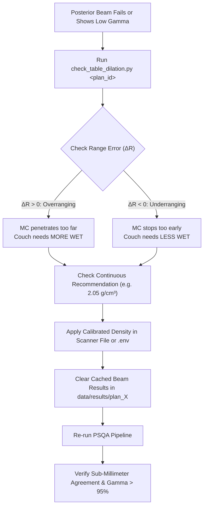

# Beam Range Verification & Couch Calibration Diagnostic Guide

This guide documents the diagnostic range check and couch calibration utilities in Virtual PSQA. These command-line tools enable medical physicists to analyze central-axis depth-dose profiles, evaluate distal edge agreement between openMCsquare and the Treatment Planning System (TPS), diagnose couch-traversal discrepancies, and determine precise sub-millimeter couch density calibrations.

---

## Table of Contents

1. [Clinical Background & Purpose](#1-clinical-background--purpose)
2. [Diagnostic Tools Overview](#2-diagnostic-tools-overview)
3. [`check_table_dilation.py` — Couch Calibration & WET Simulation](#3-check_table_dilationpy--couch-calibration--wet-simulation)
4. [`range_check_v2.py` — High-Precision Central-Axis Depth-Dose Check](#4-range_check_v2py--high-precision-central-axis-depth-dose-check)
5. [`posterior_range_check.py` — Quick Posterior Beam Evaluation](#5-posterior_range_checkpy--quick-posterior-beam-evaluation)
6. [Supporting Diagnostic Scripts](#6-supporting-diagnostic-scripts)
7. [Step-by-Step Clinical Calibration Workflow](#7-step-by-step-clinical-calibration-workflow)
8. [Interpretation of Output & Troubleshooting](#8-interpretation-of-output--troubleshooting)

---

## 1. Clinical Background & Purpose

In proton pencil beam scanning (PBS), distal dose falloff is exceptionally steep ($80\% \to 20\%$ in $2–5\text{ mm}$ of water). Consequently, distal range agreement is one of the most sensitive indicators of dose accuracy:

- **Non-Couch Beams (Anterior / Lateral / Oblique):** Enter directly into patient tissue. When CT calibration curves are properly commissioned, MCsquare and TPS doses typically show excellent distal edge agreement ($\le \pm 0.5\text{ mm}$) and high gamma passing rates ($>95\%$ at $3\%/3\text{mm}$ and $2\%/2\text{mm}$).
- **Posterior Beams (Gantry $120^\circ–240^\circ$):** Must traverse the patient couch top and immobilization hardware before entering the patient.

```
       Proton Beam (Gantry 180° / Posterior)
                       │
                       ▼
    ┌─────────────────────────────────────┐
    │  Couch Outer Shell (CFRP, ~2.0 g/cm³)│  <-- High density, thin wall (1.5 - 3 mm)
    ├─────────────────────────────────────┤
    │  Couch Core (Air or Rohacell foam)  │  <-- Low density cavity (40 - 100 mm)
    ├─────────────────────────────────────┤
    │  Couch Inner Shell (CFRP, ~2.0 g/cm³)│
    └─────────────────────────────────────┘
                       │
                       ▼
            [ Patient External / Skin ]
```

### Why Discrepancies Occur in Posterior Beams
1. **CT Grid Discretization (Staircasing):** A $1.5–2.5\text{ mm}$ curved carbon-fiber shell mapped onto a $1\text{ mm} \times 1\text{ mm} \times 2\text{ mm}$ CT grid exhibits partial-volume staircasing.
2. **Coarseness of Integer Voxel Dilation:** Expanding the shell by 1 voxel adds $\approx 2.3\text{ mm}$ of Water-Equivalent Thickness (WET) per traversed wall ($\approx 4.6\text{ mm}$ for entry + exit walls). If a plan exhibits slight overranging of $+1.0\text{ to }+1.5\text{ mm}$, 1-voxel dilation overcorrects into severe underranging ($-0.8\text{ to }-1.3\text{ mm}$).
3. **Core Cavity Material Definition:** Some TPS templates model the interior cavity as lightweight structural foam (e.g., Rohacell $\rho \approx 0.03–0.08\text{ g/cm}^3$). If the Monte Carlo engine assumes vacuum air ($\rho \approx 0.001\text{ g/cm}^3$), an $80\text{ mm}$ beam path through the core will miss $2.5–6.0\text{ mm}$ of WET.
4. **Stopping Power Ratio (RSP) Differences:** Subtle chemical composition differences between the TPS carbon model and the MC composite CFRP material can introduce $1–2\%$ range shifts.

The diagnostic tools in `backend/_diagnostics/` quantify these effects along each beam's central axis ray and provide the exact calibration values needed to achieve sub-millimeter agreement.

---

## 2. Diagnostic Tools Overview

| Script | Primary Function | Input Requirements | When to Use |
| :--- | :--- | :--- | :--- |
| **`check_table_dilation.py`** | Ray traces couch contours, computes WET, simulates dilation & continuous density sweeps, recommends exact shell $\rho$. | RTPLAN, RTSTRUCT, CT, and optional beam doses. | **Primary tool** when posterior beams fail gamma or show range shift. |
| **`range_check_v2.py`** | Samples absolute depth-dose along central ray, measures distal $80\%/50\%/20\%$ edges, Bragg peak, and entrance dose. | Computed MC beam doses (`.mhd`/`.npz`) and TPS beam doses. | To evaluate range agreement across **any** beam (anterior or posterior). |
| **`posterior_range_check.py`** | Compares distal edges and ray Center-of-Mass (COM), prints upstream entrance HU profile. | Computed MC beam doses and TPS beam doses. | Quick sanity check of upstream couch HU and beam COM alignment. |
| **`check_axis_wet.py`** | Measures cumulative WET and geometric distance along central axis through CT and couch structures. | CT volume and RTPLAN. | Verifying ray path lengths and water equivalence without running MC. |
| **`check_couch.py`** | Inspects RTSTRUCT couch contours and reports voxel count, bounding box, and assigned materials. | RTSTRUCT file. | Verifying that couch structures are properly recognized by name/type. |

---

## 3. `check_table_dilation.py` — Couch Calibration & WET Simulation

[`backend/_diagnostics/check_table_dilation.py`](backend/_diagnostics/check_table_dilation.py) is the primary calibration utility for posterior beam delivery.

### What It Does
1. **DICOM Ingestion & Active Plan Matching:** Scans the plan's DICOM store, identifies the active `RTPLAN`, corresponding `RTSTRUCT`, CT series, and per-beam TPS RTDoses.
2. **Couch Structure Discovery:** Detects couch shells (MedPhoton, Qfix, etc.) and core cavities. Inspects DICOM tag `(3006, 00B0)` (`ROIPhysicalPropertiesSequence`) for non-air core foam densities (e.g. Rohacell $\rho > 0.01\text{ g/cm}^3$).
3. **Ray Tracing:** Calculates the central axis ray from isocenter along the gantry angle direction vector:
   $$\vec{d} = \left(-\sin\theta_{\text{gantry}},\, \cos\theta_{\text{gantry}},\, 0\right)$$
4. **Dose Falloff Comparison:** Samples MCsquare and TPS doses along the ray and determines the distal $80\%$ falloff edge:
   $$\Delta R_{80\%} = R_{80\%, \text{MC}} - R_{80\%, \text{TPS}}$$
   - **$\Delta R > 0$ (Overranging / Overshoot):** The MC beam penetrates deeper than TPS $\implies$ couch in MC carries *less* WET than TPS.
   - **$\Delta R < 0$ (Underranging / Short):** The MC beam stops short $\implies$ couch in MC carries *more* WET than TPS.
5. **Dilation & Continuous Density Simulation:**
   - Evaluates couch WET under discrete integer dilation ($0, 1, 2, 3, 4\text{ voxels}$).
   - Evaluates couch WET under continuous density variation ($\rho \in [1.70, 2.40]\text{ g/cm}^3$ in $0.05$ increments) at 0 dilation, preserving exact geometric shape.
6. **Clinical Recommendation:** Calculates the exact continuous density $\rho_{\text{rec}}$ that zeros out the observed range shift down to $<0.1\text{ mm}$ precision:
   $$\rho_{\text{rec}} = \rho_{\text{nominal}} \times \left(1 + \frac{\Delta R_{80\%}}{\text{WET}_{\text{nominal}}}\right)$$

### Command-Line Usage

```bash
# 1. Run by Database Plan ID (most common)
.venv_linux/bin/python backend/_diagnostics/check_table_dilation.py <plan_id>

# 2. Run for a specific beam number (e.g. Beam 1)
.venv_linux/bin/python backend/_diagnostics/check_table_dilation.py <plan_id> --beam 1

# 3. Test a specific candidate shell density (e.g. 2.05 g/cm³)
.venv_linux/bin/python backend/_diagnostics/check_table_dilation.py <plan_id> --density 2.05

# 4. Point directly to an unindexed DICOM store folder
.venv_linux/bin/python backend/_diagnostics/check_table_dilation.py --store /path/to/dicom_folder

# 5. Point directly to an RTPLAN file
.venv_linux/bin/python backend/_diagnostics/check_table_dilation.py --store /path/to/RP.dcm
```

### Sample Output

```text
Scanning DICOM Store: /data/dicom_store/PATIENT_001
Active RTPLAN: RP.1.2.3.4.dcm (Fields: 3)
RTSTRUCT:     RS.1.2.3.4.dcm
CT Geometry:  Grid=(Y=512, X=512, Z=217)  PixelSpacing=(0.98, 0.98) mm  SliceThickness=2.00 mm

Identified Couch Structures:
  • Shell: 'MedPhoton Couch (Shell)' (Target density: 2.03 g/cm3)
  • Core:  'MedPhoton Couch (Core)' (Air, -1000 HU)

================================================================================
BEAM 1: Posterior (Gantry 180.0°) — POSTERIOR (Enters through Couch)
Isocenter: (0.0, -20.0, -110.0) mm  Travel Dir: (0.000, -1.000, 0.000)
Observed 80% Distal Range Shift (MC - TPS): +1.20 mm  [OVERRANGING / OVERSHOOT]
--------------------------------------------------------------------------------
INTEGER DILATION SWEEP:
Dilation        | Shell Voxels   | Couch WET (mm)   | Δ WET vs 0   | Predicted Residual Shift
--------------------------------------------------------------------------------
0 vox (current) | 1,456,159      | 9.15             | +0.00 mm     | +1.20 mm
1 vox           | 1,498,665      | 11.47            | +2.31 mm     | -1.11 mm
2 vox           | 1,540,781      | 13.79            | +4.63 mm     | -3.43 mm
--------------------------------------------------------------------------------

--------------------------------------------------------------------------------
CONTINUOUS DENSITY SWEEP (at 0 dilation — preserving exact geometry):
--------------------------------------------------------------------------------
Density (g/cm³)   | Relative Scale   | Couch WET (mm)   | Δ WET vs Nom   | Predicted Residual Shift
--------------------------------------------------------------------------------
1.95 g/cm³        | 0.961x (-3.9%)   | 8.79             | -0.36 mm       | +1.56 mm
2.03 g/cm³ (nom)  | 1.000x (+0.0%)   | 9.15             | +0.00 mm       | +1.20 mm
2.15 g/cm³        | 1.059x (+5.9%)   | 9.70             | +0.54 mm       | +0.66 mm
2.25 g/cm³        | 1.108x (+10.8%)  | 10.15            | +0.99 mm       | +0.21 mm  (CLOSE)
2.30 g/cm³        | 1.133x (+13.3%)  | 10.37            | +1.22 mm       | -0.02 mm  (EXACT MATCH!)
--------------------------------------------------------------------------------

>>> CONTINUOUS CALIBRATION RECOMMENDATION (RECOMMENDED OVER INTEGER DILATION):
    Observed distal range shift is: +1.20 mm.
    Integer dilation (+1 vox = +2.31 mm) is too coarse for fine calibration.
    Setting COUCH_SHELL_DENSITY_OVERRIDE = 2.30 in backend/ct_density_override.py
    (or COUCH_SHELL_DENSITY_SCALE = 1.133) adds +1.22 mm of WET,
    reducing predicted residual shift to -0.02 mm (< 0.1 mm precision)!
```

---

## 4. `range_check_v2.py` — High-Precision Central-Axis Depth-Dose Check

[`backend/_diagnostics/range_check_v2.py`](backend/_diagnostics/range_check_v2.py) evaluates central-axis depth-dose curves in absolute physical dose (Gy) to eliminate normalization artifacts.

### Key Features
- **Absolute Gy Processing:** Does not normalize curves to their own peaks. This prevents low-dose entrance tails in low-density air/tissue from shifting the relative curve.
- **Robust Distal Falloff Detection:** Finds the peak in the target high-dose region (99th percentile) and walks distal-ward to locate $80\%$, $50\%$, and $20\%$ dose falloff depths.
- **Entrance-Channel Tail Auditing:** Explicitly reports MC and TPS dose at fixed upstream positions ($-150, -120, -90, -60\text{ mm}$) to verify beam entry behavior.

### Command-Line Usage

```bash
# Evaluate all beams in Plan 15
.venv_linux/bin/python backend/_diagnostics/range_check_v2.py 15

# Evaluate only Beam 2 in Plan 15
.venv_linux/bin/python backend/_diagnostics/range_check_v2.py 15 --beam 2
```

### Sample Output Breakdown
```text
BEAM 1: Posterior_G180 (Gantry 180.0°)
  Max Dose:        MC = 1.98 Gy,  TPS = 2.01 Gy
  Peak Position:   MC = 142.0 mm, TPS = 141.5 mm  (Δ = +0.5 mm)
  Distal 80% Edge: MC = 168.4 mm, TPS = 167.3 mm  (Δ = +1.1 mm)  [MC deeper]
  Distal 50% Edge: MC = 171.2 mm, TPS = 170.2 mm  (Δ = +1.0 mm)
  Distal 20% Edge: MC = 173.8 mm, TPS = 172.9 mm  (Δ = +0.9 mm)
  Entrance Dose at -120 mm: MC = 0.18 Gy, TPS = 0.17 Gy
```

---

## 5. `posterior_range_check.py` — Quick Posterior Beam Evaluation

[`backend/_diagnostics/posterior_range_check.py`](backend/_diagnostics/posterior_range_check.py) provides a streamlined check specifically for beams with gantry angles entering through the couch ($90^\circ \le \theta \le 270^\circ$).

### Key Metrics
- **Center-of-Mass (COM) Shift:** Computes the dose-weighted spatial mean along the central axis ray. While peak location can be susceptible to statistical noise, COM provides a highly stable measure of profile alignment.
- **Upstream CT HU Trace:** Samples the CT Hounsfield Units along the entrance path, showing the exact HU values that the beam encountered as it crossed the couch shell and core.

```bash
.venv_linux/bin/python backend/_diagnostics/posterior_range_check.py <plan_id>
```

---

## 6. Supporting Diagnostic Scripts

- **`check_axis_wet.py`**:
  Traces geometric and water-equivalent distance from the CT entry point to isocenter along the central ray. Useful for verifying patient positioning and radiological depth without needing dose calculation files:
  ```bash
  .venv_linux/bin/python backend/_diagnostics/check_axis_wet.py <plan_id>
  ```
- **`check_couch.py`**:
  Prints all structures identified as couch, support, shell, or core in the RTSTRUCT, along with their contour point counts, bounding coordinates, and material tags:
  ```bash
  .venv_linux/bin/python backend/_diagnostics/check_couch.py <plan_id>
  ```

---

## 7. Step-by-Step Clinical Calibration Workflow

When clinical plans show lower gamma passing rates specifically on posterior fields:



### Step 1: Diagnose the Range Shift
Run `check_table_dilation.py` on the affected plan:
```bash
.venv_linux/bin/python backend/_diagnostics/check_table_dilation.py <plan_id>
```
Review the **Observed 80% Distal Range Shift** and the **Recommended Continuous Density**.

### Step 2: Apply the Calibration
Choose one of the three supported calibration methods:

#### Method A: Commissioned Scanner File (Recommended for Permanent Site Calibration)
Edit [`MCsquare/Scanners/default/HU_Density_Conversion.txt`](MCsquare/Scanners/default/HU_Density_Conversion.txt) line 23:
```text
8000    1.20
8001    2.05    <-- set to your recommended density (e.g. 2.05)
8500    19.20
```
*Because Virtual PSQA dynamically reads `HU_Density_Conversion.txt` at runtime, all overrides and diagnostic tools will automatically use this calibrated baseline.*

#### Method B: Environment Variable (Recommended for Local Workstation Config)
Add to your `backend/.env` file:
```bash
COUCH_SHELL_DENSITY_OVERRIDE=2.05
```
*This persists across git pulls and updates.*

#### Method C: Python Override (Quick Testing)
Edit [`backend/ct_density_override.py`](backend/ct_density_override.py) line 118:
```python
COUCH_WALL_DILATION_VOX = 0
COUCH_SHELL_DENSITY_OVERRIDE = 2.05
```

### Step 3: Clear Results & Recalculate
Because Virtual PSQA caches calculated beam dose grids to save simulation time, clear the plan's cached results before re-running:
```bash
# Remove cached simulation files for the plan
rm -rf data/results/plan_<plan_id>/mcSquare_work
rm -rf data/results/plan_<plan_id>/Dose_Beam*.mhd
rm -rf data/results/plan_<plan_id>/Dose_Beam*.raw
rm -rf data/results/plan_<plan_id>/mc_dose_beam*.npz
```
Then trigger recalculation from the Web UI or via the API. Verify that the recalculated gamma passing rate meets your clinical threshold ($>95\%$).

---

## 8. Interpretation of Output & Troubleshooting

### "Isocenter Z is outside the couch Z range"
- **Cause:** Some treatment plans place the isocenter superior or inferior to the primary couch support structure (e.g., in cranial cases with an extension plate).
- **Behavior:** The script automatically evaluates the couch ray at the mid-axial slice of the couch ($Z_{\text{mid}}$) to ensure accurate WET estimation along the representative structure geometry.

### "No RTPLAN found in store"
- **Cause:** The DICOM store directory contains CT slices and doses, but the `RTPLAN` (`RP*.dcm`) is stored in a parent or sister folder.
- **Solution:** Specify the exact plan ID (`python check_table_dilation.py 15`) or pass the path directly to the plan file (`--store /path/to/RP.dcm`).

### "Found multiple RTPLANs under search path"
- **Cause:** Multiple revisions or fractional plans were exported into the same DICOM store.
- **Solution:** The diagnostic script automatically matches the RTPLAN referenced by the active beam doses. To force a specific plan, use the `--plan-name` flag:
  ```bash
  python check_table_dilation.py --store /data/store --plan-name "Prostate_Phase1"
  ```

### "Skin guard clipped X dilated voxels overlapping External"
- **Behavior:** When integer dilation (`COUCH_WALL_DILATION_VOX > 0`) is active, [`ct_density_override.py`](backend/ct_density_override.py) automatically masks out voxels inside the patient `External` contour (`mask = mask & (~ext_mask)`). This prevents high-density couch voxels from erroneously being placed inside patient skin.
