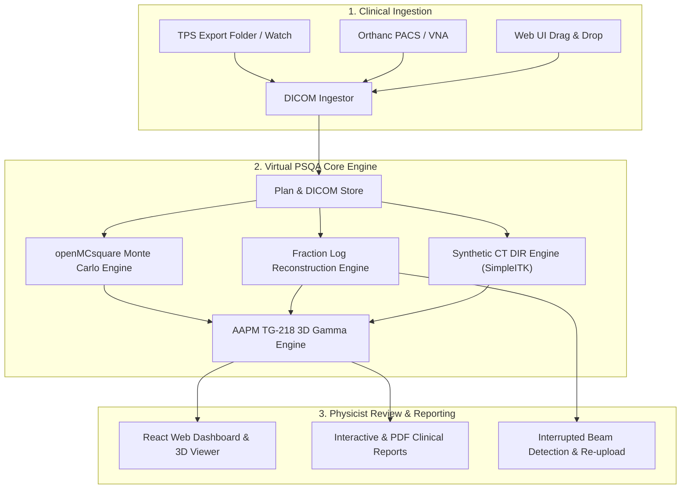

# Virtual PSQA

**Virtual Patient-Specific Quality Assurance (PSQA) platform for proton pencil beam scanning (PBS) radiotherapy.**

Virtual PSQA combines **FastAPI**, **React / Vite**, and **openMCsquare** to provide comprehensive pre-treatment and per-fraction delivery assurance:
* **Secondary Monte Carlo Dose Calculation**: Independent 3D dose verification against Treatment Planning System (TPS) exported plans.
* **Daily Synthetic CT & Adaptive QA**: Deformable Image Registration (DIR) from daily CBCT setups for fraction-by-fraction anatomical dose recalculation.
* **Fractional Machine Log Reconstruction**: Analysis of delivered spot positions, meterset weights, and 6-DoF couch shifts from RT Ion Treatment Records (`RI*.dcm`).
* **Interrupted Delivery Flagging & Re-upload**: Automated detection of early beam terminations and shortfalls, with 1-click re-upload for merged/corrected records.
* **Orthanc PACS / DICOM VNA Integration**: Built-in DICOMWeb query and retrieval of patient plans, records, and daily CBCTs.
* **AAPM TG-218 3D Gamma Analysis**: Multi-comparison 3D gamma analysis (MC vs. TPS, Log vs. Rx, Synthetic CT vs. TPS) with customizable DTA, dose difference, and isodose thresholds.
* **Air-gapped & Zero-PHI**: Operates strictly within your clinic LAN with zero external cloud dependencies.

---

## Documentation & Platform Guides

| Guide | Description | Target Environment |
| :--- | :--- | :--- |
| 🐧 [**Linux Deployment & User Guide**](README_LINUX.md) | Full setup guide for Arch, Ubuntu/Debian, Fedora/RHEL, including CPU SIMD binary selection, systemd service, and `./run.sh` | Linux Workstations & Servers |
| 🪟 [**Windows Deployment & User Guide**](README_WINDOWS.md) | Standalone portable launcher (`run.bat`), pre-bundled Windows Python runtime, and zero-dependency quick start | Windows 10 / 11 |
| 📖 [**Physicist Clinical Manual**](MANUAL.md) | Comprehensive physicist reference for clinical metrics, gate thresholds, and log verification | Clinical Physicists |
| 🚀 [**Standard Deployment Guide**](DEPLOYMENT.md) | Production server architecture, network configuration, and DICOM watch folders | Clinic IT & Administrators |

---

## Quick Start

### On Linux
```bash
git clone https://github.com/apholt/virtual-psqa-open.git
cd virtual-psqa-open
chmod +x run.sh
./run.sh
```
*Access the web UI at [https://localhost:8000](https://localhost:8000) (or `http://` if SSL is disabled). See [`README_LINUX.md`](README_LINUX.md) for full instructions.*

### On Windows
1. Download **`virtual-psqa-windows.zip`** from the [Releases](https://github.com/apholt/virtual-psqa-open/releases) page.
2. Extract to `C:\VirtualPSQA\`.
3. Double-click **`run.bat`**.
*Access the web UI at [http://localhost:8000](http://localhost:8000). See [`README_WINDOWS.md`](README_WINDOWS.md) for full instructions.*

---

## Clinical User Management & HIPAA Access Control

Virtual PSQA enforces individual user authentication to meet HIPAA Technical Safeguard requirements (**45 CFR § 164.312(a)(2)(i)** — *Unique User Identification*). User accounts, roles, and credentials are managed using the [`backend/manage_users.py`](backend/manage_users.py) CLI utility.

> [!NOTE]
> `manage_users.py` includes automatic virtual environment detection. It can be invoked directly from the project root using `python backend/manage_users.py` (or from `backend/` using `python manage_users.py`) without having to manually activate the virtualenv first.

### Default Initial Account
On first launch, an initial administrator account is automatically initialized:
* **Username**: `admin` *(or configured via `AUTH_USERNAME` in `.env`)*
* **Password**: `psqa-admin-2026!` *(or configured via `AUTH_PASSWORD` in `.env`)*

> [!IMPORTANT]
> Immediately update the default administrator password before deploying into clinical or LAN environments.

### CLI Commands

#### 1. List Registered Users
View all clinical accounts, assigned roles, and current activation status:
```bash
python backend/manage_users.py list
```
*Sample output:*
```text
ID    USERNAME           ROLE           STATUS     NAME
-----------------------------------------------------------------
1     admin              admin          ACTIVE     System Administrator
2     jdoe               physicist      ACTIVE     Dr. Jane Doe
```

#### 2. Add a Clinical User
Create a new unique account with an assigned role (`physicist`, `dosimetrist`, `admin`, or `auditor`):
```bash
python backend/manage_users.py add <username> <password> [--name "Full Name"] [--role ROLE]
```
*Example:*
```bash
python backend/manage_users.py add jdoe "StrongPassword123!" --name "Dr. Jane Doe" --role physicist
```

#### 3. Change Password
Reset or change an account's password:
```bash
python backend/manage_users.py passwd <username> <new_password>
```
*Example:*
```bash
python backend/manage_users.py passwd admin "NewSecureAdminPassword2026!"
```

#### 4. Deactivate a User
Disable login access for an account while preserving all associated audit trails and historical records (**§ 164.312(b)**):
```bash
python backend/manage_users.py deactivate <username>
```

---

## System Architecture



---

## Running the Automated Tests

Virtual PSQA includes automated tests covering DICOM ingestion, openMCsquare simulations, 3D gamma calculation, Orthanc query/retrieve, and interrupted record detection:

```bash
# Activate your environment (.venv_linux on Linux or .venv on Windows)
source .venv_linux/bin/activate

# Run tests
pytest backend/tests/ -v
```

---

## Authors & Primary Contributors

* **Aaron Hutchins** ([ahutchins180@gmail.com](mailto:ahutchins180@gmail.com)) — **System Architect**  
  *Principal author who inspired, designed, and built the core codebase, openMCsquare integration, delivery log reconstruction, and clinical QA decision engine.*
* **Adam Holt** ([apholt21@outlook.com](mailto:apholt21@outlook.com) / [@apholt](https://github.com/apholt)) — **Lead Developer & Contributor**  
  *Codebase improvements, quality-of-life features, ORTHANC integration, HIPAA security requirements, openMCsquare scenario robustness and DVH prediction modules, Linux packaging, and open-source distribution.*

---

## Acknowledgments & Citations

Virtual PSQA integrates and builds upon several key open-source medical physics projects and published clinical QA methodologies:

* **[openMCsquare](https://github.com/openMCsquare/MCsquare)**: Fast Monte Carlo proton dose engine (*Souris et al., Med Phys 2016*).
* **[Orthanc](https://www.orthanc-server.com)**: Open-source DICOM VNA & DICOMWeb server (*Jodogne S., J Digit Imaging 2018*).
* **[SimpleITK / ITK](https://simpleitk.org)**: Deformable Image Registration (DIR) using Diffeomorphic Demons for Synthetic CT calculation (*Lowekamp et al., Front Neuroinform 2013*; *Vercauteren et al., NeuroImage 2009*).
* **[pydicom](https://github.com/pydicom/pydicom)**: Medical imaging and DICOM RT object manipulation library (*Mason et al.*).
* **Fast 3D/2D Gamma Analysis**: Vectorized local-search gamma evaluation (*Wendling et al., Med Phys 2007*; *Low et al., Med Phys 1998*).
* **Clinical Task Group Guidelines**: Adheres to **AAPM TG-218** (PSQA tolerance limits & action levels), **AAPM TG-275** (physics chart check recommendations), and **AAPM TG-142** (couch 6-DoF positioning).

For complete academic citations and ready-to-use BibTeX entries, please see [**`CITATIONS.md`**](CITATIONS.md).

---

## License & Clinical Disclaimer

Virtual PSQA is intended for quality assurance and research verification in radiation oncology. All clinical treatment decisions and plan approvals must be performed in accordance with institutional protocols and approved primary treatment planning systems.
